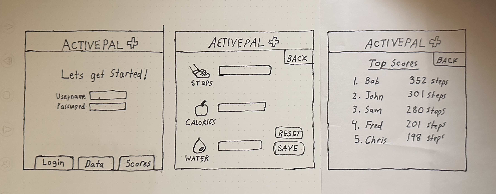

# Fitness Tracker
## Specification Deliverable
### Elevator Pitch
Have you been looking for a good reason to exercise and accomplish your health goals? The new Fitness Tracker makes it easy for users to record their daily steps, calories, and water intake. Every user can see their personal health data and track their progress over time. As users record their data daily, users will receive realtime information on how they performed against others. This use of health data over real time will help users to have fun, while achieving their health goals, through friendly competition.
### Design
