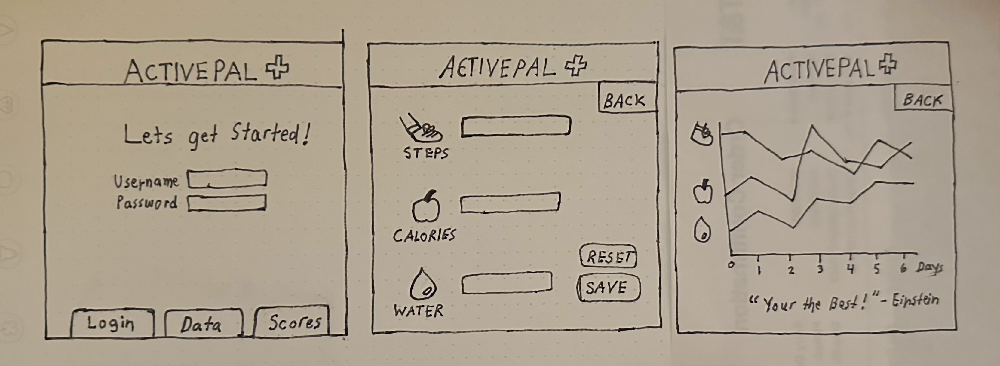

# Fitness Tracker
## Specification Deliverable
### Elevator Pitch
Have you been looking for a good reason to exercise and accomplish your health goals? The new Fitness Tracker makes it easy for users to record their daily steps, calories, and water intake. Every user can see their personal health data and track their progress over time. As users record their data daily, users will receive daily motivational quotes to encourage them towards their goals. This use of health data over real time will help users to have fun, track their progress, all while achieving their health goals.
### Design

### Key Features
- Secure User Login
- Display of various fitness factors
- Ability to enter personal health data
- Inputs entered are recorded over time
- Display of their data on easy-to-read graphs.
### Technologies
- **HTML** - Uses HTML for website application structure. 3 HTML pages, one for login, one for inputting data, and one for viewing progress over time.
- **CSS** - Application adjusts for good viewing on various screens. CSS used to display colorful designs and shapes and eye-catching symbols.
- **JavaScript** - Used in login/authentication step, display of personal progress, inputting fitness data, and navigating different pages.
- **WebService** - I will use a Workout API that a user can input a desired muscle or workout to recieve a selected excersise to try.
- **Database** - Database will be use to store login information and personal health data.
- **Websocket** -  On the record html page, notifications will be received when user has recorded personal data for 1,2,3,etc. straight.
- **React** - Web application will be redeveloped in the React framework.

## HTML deliverable

For this deliverable I built out the structure of my application using HTML.
- **HTML pages** - Four HTML pages, homepage for logging in, record page for submitting data, progress page for viewing graphical trends, and leaderboard page for top scores.
- **Links** - Login on homepage links to the user's record page. Navigation menu consists of 4 links to the other HTML pages.
- **Text** - Each data type on the record page has a logo with text associated with it. Textual keys for the graph on the progress page and text used to list a static leaderboard.
- **Images** - I included 3 images to represent the 3 types of data to submit on the record page.
- **DB/Login** - Username/Password input and login button. Submit button on record page used to submit user's data to DB. Leaderboard represents data pulled from DB.
- **WebSocket** - The motivational dailyquote on the progress page represents a random quote pulled from an API.

## CSS deliverable

For this deliverable I applied CSS styling to my web application to get my desired design.
 - **Header,footer, and main content body**
 - **Navigation element** - I changed the text color, used flex, and implemented the anchor elements into a bootstrap navigation bar.
 - **Responsive to window resizing** - I used flexbox via the Bootstrap framework to make the pages adjust to various widths and lengths.
 - **Application elements** - I used only 3 primary colors and styles the pages using large sections of solid colors to highlight different elements of each page.
 - **Application text content** I used Boostrap's built-in font-style on all my pages.
 - **Application image** I used free SVG images from unDraw's library on my index/record html pages.

## JavaScript deliverable

For this deliverable I implemented using JavaScript so that the application works for any single user. I also put places in my code for future technology.

- **login** - When you click the login button after entering a username it takes you to the record page.
- **database** - On the progress.html page, mock data is being used as a placeholder. On the leaderboard.html page, a table of user data is being displayed from localStorage but it will be replaced with the database data later.
- **WebSocket** - I used an Alert method on the record page that pops up when data is submitted but this will be replaced with WebSocket messages later.
- **application logic** - The leaderboard table updates user data is inputted and drawn from localStorage.
